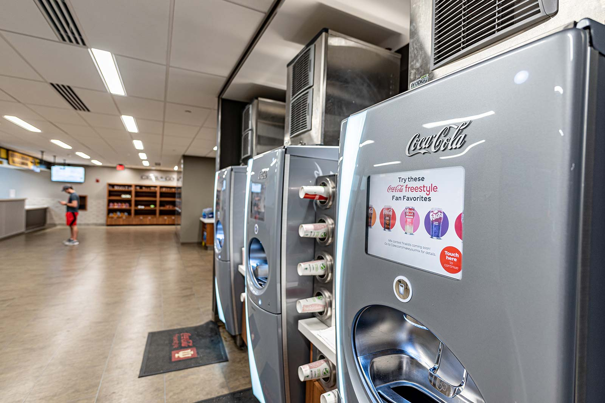

Coca-Cola Freestyle is the greatest missed opportunity in the history of modern humanity. Okay, maybe a bit of an exaggeration. But, let me explain.

For those without the pleasure, [Coca-Cola Freestyle](https://en.wikipedia.org/wiki/Coca-Cola_Freestyle) is a touch screen soda fountain featuring 165 different Coke products, as well as custom flavors. Completely self-service, users are seconds away from creating a near-infinite amount of soda combinations, from creating a cherry-vanilla-raspberry-Sprite-Coke-Hi-C monstrosity, [to resurrecting discontinued Coke products](https://www.eatthis.com/discontinued-coca-cola-drinks/).

For a brief moment in the 2010's, Freestyle made soda cool again. Yet as [soda sales steadily decline](https://www.ibisworld.com/us/bed/per-capita-soft-drink-consumption/1786/), I'm obsessed by this idea that Coke could've done a lot more to turn Freestyle into a sustainable, cultural phenomenon that hinted at the future of computing.

First, let's get social! Freestyle users should see a leaderboard of the most used soda, syrups, and combos at any particular machine. Coke has already publicized that [microchips and RFID technology exist in every machine](https://arc.net/l/quote/znpzwiny) as a way to detect supply and alert distribution centers. It would be trivial to present these usage metrics to the user as a cool way of showing how one's campus, office, or neighborhood consumes Coke. A creative way to use this data is to promote local events. I went to school at Indiana, whose big rival is Purdue. As the big game approaches, let's show the Purdue campus's leaderboard on IU machines as a fun way to show differences/similarities between schools, plus promote the game. You know who drinks a lot of Coke? Sports patrons.

Second, flavor trialing. Next to this leaderboard, Freestyle users can select from a list of flavors that Coke is considering productizing into a can or bottle. Users can then rate the flavor on [the Coca-Cola +one app](https://www.coca-cola.com/us/en/apps) or simply continue purchasing the flavor. Consumers would be incentivized to use the app by Coke offering discounts on trialed flavors. Who says all fountain drinks must be $2.50? I think Coke would gladly give a 50% discount, as it means adding a new market research heuristic that is more scalable than any localized test market or focus group could ever provide.

Lastly, data data data. Assuming Coke convinces its users to adopt the +one app (as Starbucks, Chipotle, and Whole Foods have), Freestyle usage could be analyzed against a wealth of logged-in user data, such as location, age, gender, purchase history, and even interests (if a Google or Facebook sign-on were adopted). Beyond the obvious benefit this would have on market knowledge, imagine the ad campaigns that can be built off this. Look at that- Taylor Swift fans love Peach Fanta! Wow, Coke made a song about the most popular flavor for each March Madness team! Selfishly, I would love to see a public Freestyle API, so companies and hobbyist developers could get insights on soda data. It would be an impressive signal to the developer community that Coke is a tech-forward company to work at.

The bigger picture is that Coke had a chance to make Freestyle an early example of a new wave of technology: [Ambient Computing](https://design.google/library/more-human-ambiance-in-ambient-computing). As hardware and cellular infrastructure get more efficient, technology will get more integrated in our everyday lives and objects. By transforming a simple soda machine into a data-driven, social platform, Coke could have tapped into the essence of ambient computing, where data is used to the benefit of user by creating a delightful, personalized experience. Hey, maybe the weed shops will figure it out.