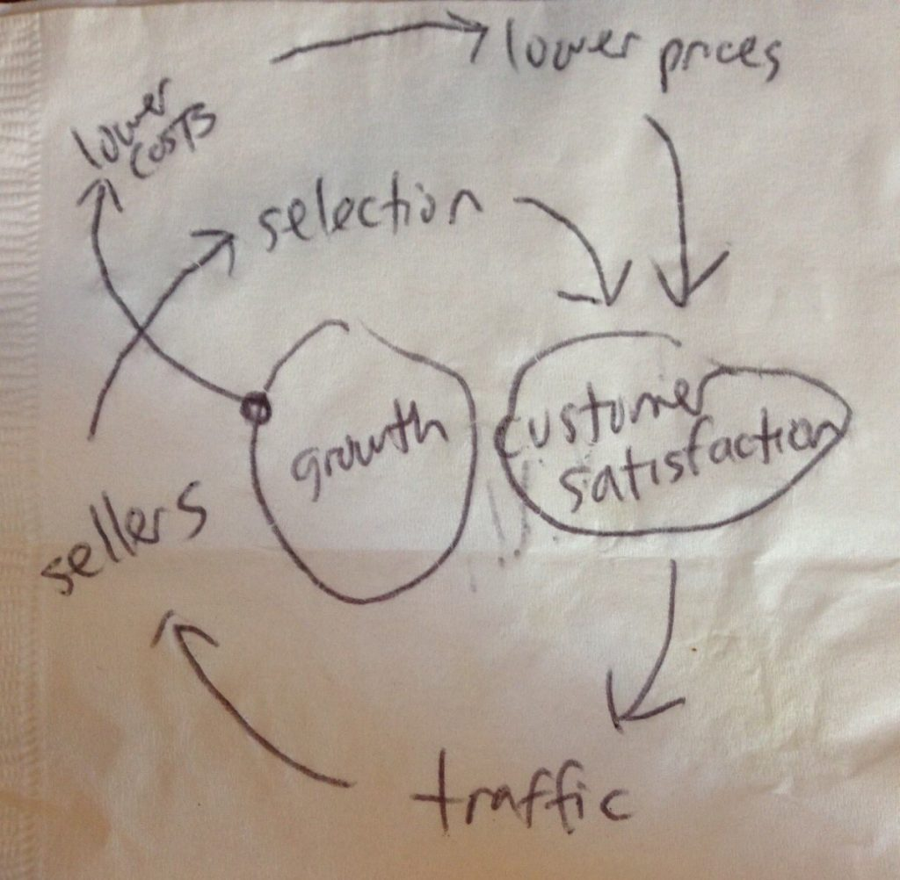

A **network effect** is when the value of a product or service increases as more people use it, creating a self-reinforcing cycle of growth. Social media platforms like Facebook and X are more valuable when one million users, instead of 100, are contributing to it. Uber and Lyft riders get more convenience and value when more riders join, as the demand brings in more drivers. Jeff Bezos' famous napkin drawing of Amazon's strategy in 2001 depicts network effects in action: low prices attract users, which attract sellers, which attract more users, and so on: 

While listening to [an episode of Unsolicited Feedback](https://youtu.be/MzniuV8o59U?si=-rL_G-QjmL_c96Wi), the concept of network effects came up in the consumer AI market. Co-host Fareed Mosavat argued that generative AI products like ChatGPT and Perplexity struggle with long-term growth due to a lack of network effects:

> "Most of these [consumer AI products] have word-of-mouth, but they don't have network effects yet. They have ***data*** network effects, like more data makes the product better, but they don't have 'Casey and I both use it, so Perplexity is better [for me] because Casey also uses it.'" - Fareed Mosavat, [Unsolicited Feedback w/ Casey Winters (10:55)](https://youtu.be/MzniuV8o59U?si=dP67_nNUgoHGcTZB&t=655)

Fareed acknowledges ***data*** network effects. A general trend shows that the larger the AI model (the more data it's trained on), the better its performance. Also, users today can easily give data to the AI model by providing feedback, commonly known as [RLHF (Reinforcement Learning from Human Feedback)](https://arc.net/l/quote/hciqfwbs). Does this qualify as a pure network effect? Fareed doesn't think so, and I think it's because RLHF provides *indirect and collective* benefits to its ecosystem rather than *immediate and personalized*. If my co-worker Casey provides feedback to an AI about our sales process, the AI tool will not account for that narrow scope of knowledge and distribute it only to relevant individuals. Rather, an increase in users only benefits a blackbox learning algorithm, in which a centralized authority chooses the best way to distribute the learnings. This middleman bottlenecks the self-reinforcing cycle of growth exemplified in products with network effects.

Two things I want to say:

First, I want to push back that no consumer AI products have network effects. ChatGPT users can create [custom GPTs](https://openai.com/blog/introducing-gpts), which are no-code/low-code agents that have more nuanced knowledge and skills. GPTs can then be published to the GPT Store or shared via URLs. I'm already beginning to feel a little lock-in from these network effects, as I've greatly benefited from other peoples' GPTs! Another example of network effects is with text-to-speech tool [ElevenLabs](https://elevenlabs.io/), where [users can create their own voice clone and share it on the Voice Library](https://arc.net/l/quote/dpowgcbr). Users receive royalties when their voice is used, incentivizing further supply. OpenAI has hinted at a similar monetization model with GPTs.

Second, do network effects even matter in the age of generative AI? Despite Fareed's skepticism about scaling without network effects, the unique capabilities of AI may diminish their traditional importance. Historically, network effects were crucial due to the direct link between the number of users and supply. Amazon can't manufacture everything it sells. Uber can't hire every driver (hot take!). Facebook can't create every post. But, what happens when the product ***can*** produce all the supply for its users? Like most things, the truth is in the middle. Depending on the use case, network effects will be extremely valuable to some consumer AI tools. But, I don't think AI companies must mold to a business model shown on a napkin from 2001. We got rid of [frosted tips and belly button chains](https://www.buzzfeed.com/mjs538/early-2000s-fashion-trends). Maybe, we'll get rid of network effects.