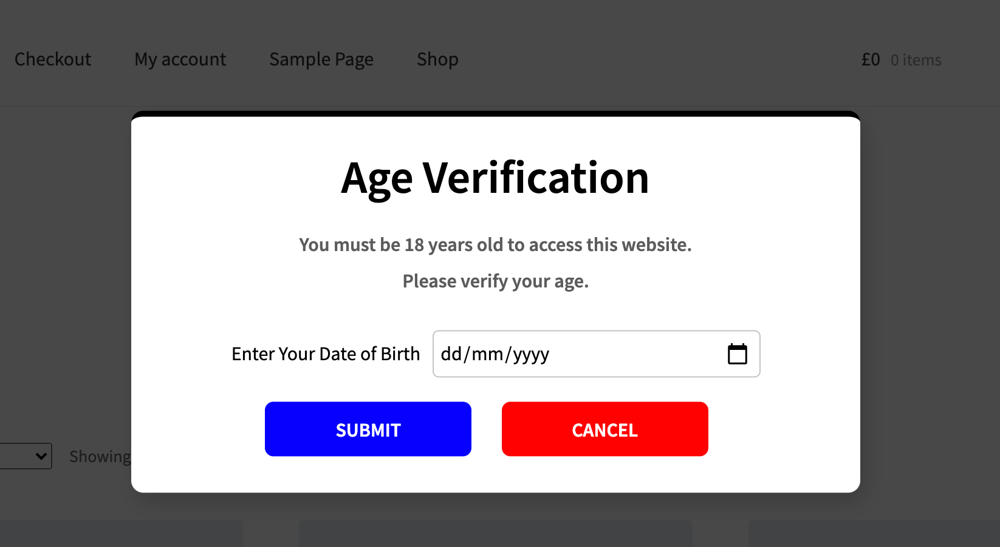
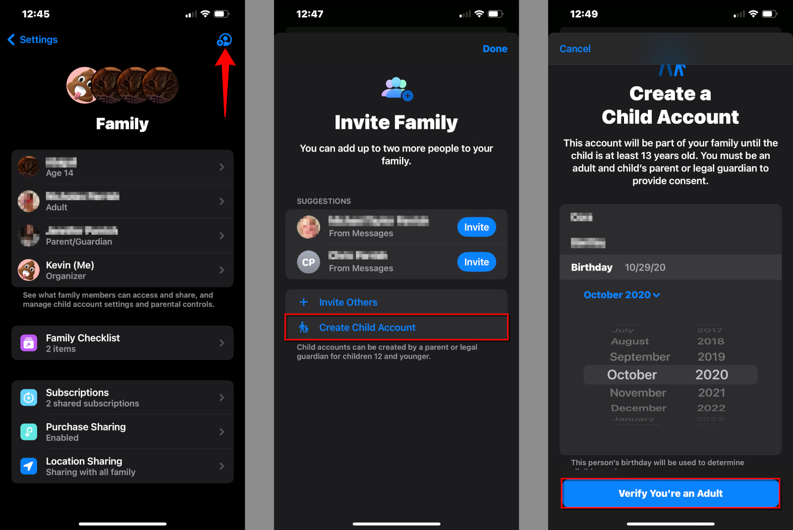

During [the congressional online safety hearing on January 31st, 2024](https://www.youtube.com/watch?v=mtj3e_s_s-M), Meta CEO Mark Zuckerberg and Senator Amy Klobuchar had the following exchange regarding Meta's opposition to the [STOP CSAM](https://www.judiciary.senate.gov/press/dem/releases/senate-judiciary-committee-advances-durbins-stop-csam-act-to-crack-down-on-the-proliferation-of-child-sex-abuse-material-online) and [SHIELD](https://www.klobuchar.senate.gov/public/index.cfm/2023/2/klobuchar-cornyn-introduce-bipartisan-legislation-to-address-online-exploitation-of-private-images) Acts, the key goals of which are to combat online child exploitation while giving the government tools to undermine encryption and hold tech companies accountable. From the 1:08:42 to the 1:13:29 mark:



To summarize, Zuck agreed with the goals of the two acts but felt the approach could be improved. He proposed that mobile platforms, namely Apple and Google, should be responsible for enforcing age restrictions and parental controls. This would simplify the process for parents, as managing content exposure would be handled at the device level rather than through each individual app. In response, Klobuchar confirmed that parents feel overwhelmed by the current state of social media harm and suggested that placing more responsibility on social media platforms like Facebook and Instagram would improve the situation.

Something remarkable has happened: I actually agree with the tech billionaire and disagree with the Democrat Senator. I found Zuck's comments to be completely reasonable, scalable, and developer-friendly, while Klobuchar's to be divisive and unconstructive, as if she were talking through him.

Let's make this more clear. How many times have you come across a popup like this?

Annoying, right? Every time I see this, I'm reminded of how regulators don't understand the tech which they aim to regulate. Zuck argues this does not address the root issue. You cannot protect children unless you know if your users are children, and asking the child themself to confirm their age is a feckless attempt. As a developer and everyday online user, I believe app-level age verification creates the following consequences:

1. More Dev Resources: Regulated companies, regardless of size, must allocate SaaS spend or developers for age verification, increasing IT overhead.
2. Poor User Experience: App-level age verification leads to annoying, inconsistent pop-ups, similar to "Allow Cookies" notifications 🤮.
3. Excessive Data Collection: Each app verifying age gathers an additional data point, increasing privacy concerns.
4. It Doesn't Work: Do you ever put in your *actual* age? Of course not! And if you don't do it, it's a safe bet that teens don't do it either. 

Device level verification can solve these problems. Today, Apple users can create child accounts, allowing parents to provision an iPhone or iPad to their kid. Child accounts can have time limits on certain apps, blockers on specific websites, and restrictions on explicit iTunes and Apple TV content. You can create a child account in three steps: 

Apple and Google do not pass any of this information to apps. Zuck argues that the age which the parents place above is much more reliable than a popup. A privacy-friendly solution can also be made, where instead of Apple sending the exact birthdate of the user, it can simply send a flag (i.e. `isMinor? = True`). Apps can then curate an experience for teens that faithfully complies with current and future regulations. 

### What Regulators Get Wrong

This fun, little age verification debate is a microcosm for how lawmakers in both political parties don't know how to regulate big tech. The key factor is *consumer sentiment*. Railroad regulation was driven by consumer discontent due to discriminatory practices and monopolistic pricing by railroad companies. What's different today is that lawmakers are fighting tech companies whose consumers are not only loyal but *addicted* to their services. Teens, the true experts of social platforms (not the parents), can easily break age checks.

Until lawmakers become honest about the psychology of tech addiction and the relationship between devices and applications can they find a just solution. The current architecture of the internet puts a lot of control in the hands of the device makers. When I wanted to buy Call of Duty as a kid, I needed parental approval before leaving Gamestop with the disc. Apple and Google are the new gatekeepers of distribution, and they must be discussed as such.

### Final Thoughts

Oh! I didn't even cover how these bills could let the government sidestep encryption. Also, with all this talk about Apple, Google, and Meta, it got me thinking: *what is a platform?* 

Two topics for another time.
