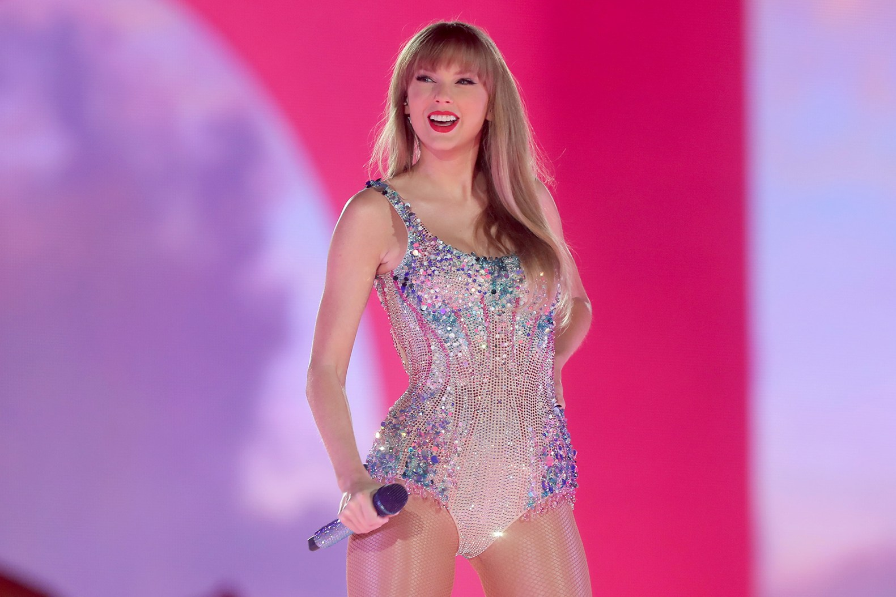
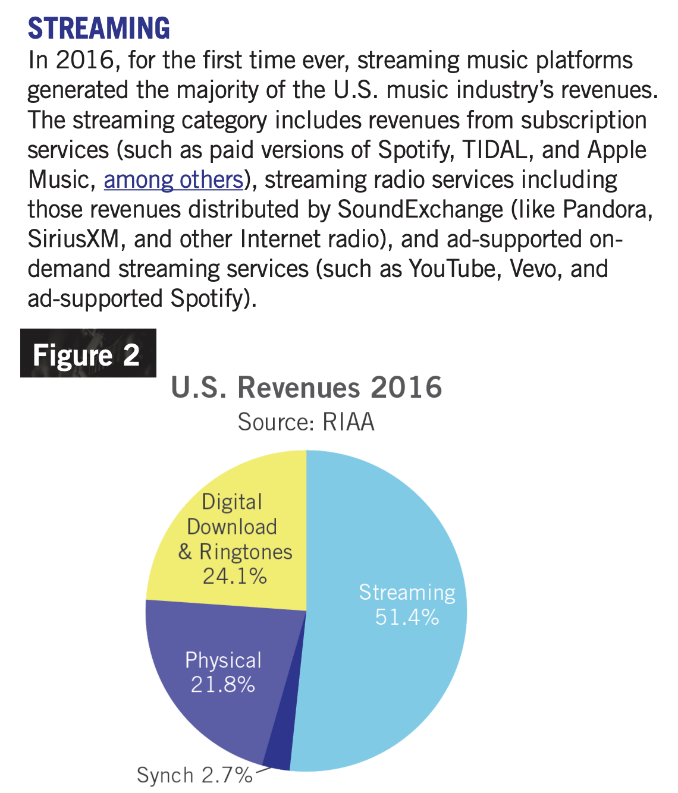

I believe there will never be an artist bigger than Taylor Swift. Yes, she's a talented musician. Yes, her sound appeals to various demographics. But, I'm not arguing no one will be more *talented* than her. Before Taylor, there was Beyoncé, then there was MJ, and The Beatles before him. So, why don't I expect another to follow? Beyond an artist's talent and business ingenuity, there are externalities which they cannot influence. In this case, tech's disruption in entertainment will greatly hinder any artist's ambition to surpass TayTay.

### Timing and Skill

Timing is the luckiest asset a business can have, and Taylor had it in abundance. She began her career as a country singer in the mid-2000's, attracting the prominent millennial generation. Recognizing the ceiling of country music, Taylor moved into pop. By switching to a more mainstream genre and leveraging Obama-style social media tactics of [engaging directly with fans](https://www.reddit.com/r/TaylorSwift/comments/k17waw/taylor_replied_to_fans_on_twitter/), her career skyrocketed. In 2010, Taylor ranked 14th among most Twitter followers. By 2015, she was 3rd (behind Katy Perry and Justin Bieber).

Taylor's rise aligned with the record labels' final years of oligopoly in music distribution. In the early 2010's, music still had to be *purchased*- CDs were still bought, and iTunes was still selling music on a per-album or per-song basis. In fact, [it wasn't until 2016 that streaming services (Spotify, Apple Music, Tidal) generated the majority of music revenue](https://www.riaa.com/wp-content/uploads/2017/03/RIAA-2016-Year-End-News-Notes.pdf): 

Taylor's presence before music streaming, when a few dominant record labels controlled the industry, allowed her to accrue significant wealth and influence, a luxury which artists today do not have. She took that wealth and influence into the streaming era by [challenging Spotify](https://www.rollingstone.com/music/music-news/taylor-swift-abruptly-pulls-entire-catalog-from-spotify-55523/) ([and winning](https://www.vox.com/culture/2017/6/9/15766576/taylor-swift-spotify-streaming-katy-perry)), as well as convincing her fanbase to [continue buying her albums directly](https://arc.net/l/quote/awiuewmw), as a form of protest against the corporate overlords.

Taylor's dominance across two eras of music and her business ingenuity in social media and consumer loyalty are reasons enough no one will become bigger than her. But, true disruption lies in the heart of technology, not any individual...

### Algorithms: A Taylor Swift for Everyone

I want you to go back to a time before music or tv streaming- maybe 2010. What cultural moments did you talk about at the office or lunch table? Maybe it was the game, or the latest episode of *Friends* or *The Sopranos*, or Eminem's newest album. Some people might be uninterested, but *at least everyone was on the same page*. Now, think of those conversations today. How many times has a friend told you about the latest Netflix show, and you don't even know what the hell they're talking about?? Same goes for artists, influencers, actors, and even consumer brands. You're not alone. 

This rapid shift in less than a decade is credit to streaming services and their algorithms. When we moved our entertainment from the thumb drive to the web, we allowed tech companies to take note of every interaction we had with them. Every time we select, play, pause, share, or comment, that is a data point for their algorithms. These algorithms allow for hyper-unique content feeds, making every person's Facebook, Spotify, and Youtube homepages completely different. Now, instead of tuning to NBC on Thursday night to watch *The Office*, every person now has the luxury to watch whatever.

This brings us back to Taylor Swift. Taylor's excellent timing and quality marketing got her to the top, but the technological state of content delivery will keep her there. Our society has moved from record store monoculture (pop), to digital subculture (dance-pop, K-pop, pop rock) to hyper-individualized algorithm culture (Ben's preferred pop). And, given user satisfaction in these apps, users seem to prefer society this way. As Generative AI today can already produce convincing music ([Udio](https://www.udio.com/)) and video ([Sora](https://openai.com/sora)), one can foresee entire albums and movies being created for individuals in seconds.

There will be no one bigger than Taylor Swift, because monoculture is heading to its death.

Although, people still do like watching NFL games and going to stadium concerts, so I could be totally wrong lol.
