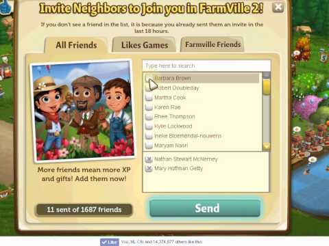

I'm confused. In my 6-year career, all three of my employers have considered themselves "platforms":

But, ***what is a platform?*** How did the word make its way into tech? And what does its universal usage tell us about building a great tech product?

In an everyday sense, we think of a platform as a smooth, raised surface at somewhere like a rail station. One can carry, roll, push, etc. any thing on it. Hardware and software companies used this metaphor in the 80s and 90s when they were building surfaces above a rugged underbelly for the benefit of other companies. For example, Microsoft's Windows was a platform for developers to build applications on computers without the need to worry about hardware interactions, memory management, and other 1s and 0s tasks. In its purest essence, *a platform is a stack of technology that third-party developers can build on top of*.

I want to talk about a supposed platform, but not for the reason you think: Facebook. Remember [FarmVille](https://farmville3.com/)? I remember my sister playing this farming simulator on Facebook in the late 2000s. To users, it was another fun game on the web. But to Facebook, it was a proof of concept for something greater. In 2007, [Facebook launched the Facebook Platform](https://techcrunch.com/2007/05/24/facebook-launches-facebook-platform-they-are-the-anti-myspace/)- a set of tools for third-party developers to create their own applications and services that access data in Facebook. FarmVille, created by [Zynga](https://www.zynga.com/), was one of the first apps built on it. Zynga could present all its games on Facebook.com and benefit from the social media's data. A user didn't have to create an account to join FarmVille; rather, the user could simply play the game under their Facebook ID. Further, the user's social graph was shared automatically with Zynga, allowing a unique experience of sharing "farms" between friends.

This architecture was groundbreaking- in a few lines of code, any developer could build an app without thinking about user management (account creation, authentication, spam bots, social graphs, etc.). Instead, developers could leverage Facebook's dominance in user management and benefit from the network effects of its massive social network. Facebook Platform's inception marked the beginning of [Mark Zuckerberg's master plan](https://arc.net/l/quote/vxyejnyb): to make Facebook an "operating system [for] full applications." To the average human, opening Facebook would feel no different than a browser- a single network of infinite application. To Facebook, the upside is obvious. The more applications that are built on Facebook, the more time and data users contribute to Facebook, resulting in limitless payments and advertising monetization.

To me, *Facebook enabling third-party developers to add new **things** to the site defined it as a platform*. It is not a platform by its standalone ability for users to post messages and photos. 

I emphasize ***things*** because it's so critical. A **website** is a dumb page on the internet, like my blog, `ben-mini`. If I were to let users comment and like my posts (the main "thing" on my site), it would become an **application**. Now, if I were to allow others to build entirely new things on `ben-mini`, like games, stock pickers, celebrity heights, or whatever, I would have a **platform**. The presence of things and allowing or disallowing the manipulation of one thing from another is a fundamental of [object-oriented programming](https://en.wikipedia.org/wiki/Object-oriented_programming). Understanding what things are on a tech product is understanding its basic architecture, and it's how I determine if it's a platform or just an application.

The broader takeaway isn't a semantic exercise: knowing what is and isn't a platform should affect how buyers understand a product and how executives think about their competitive advantage. A buyer who sees the word "platform" subconsciously equates the product to power and extensibility, as the word suggests they can build whatever "thing" they want on it. That power comes at the tradeoff of time and developer resources. I ask product marketers: is that what you truly want to communicate to the market? Because, it turns out the platform economy might not work for some businesses. In the last decade, [Facebook is seeing a mass exodus from the Facebook Platform](https://andrewchen.com/why-developers-are-leaving-the-facebook-platform/). This is in part because of Facebook's realization that its core product, posts of friends and family, drives the most conversion. Building developer tools for outside developers is a risk and distraction from the main focus.

But hey, I get it. Becoming a platform is surely the dream for most tech founders, as it puts you at the head of the table for dictating the next wave of Silicon Valley development. Zuckerberg is still trying to become a platform, as [it recently opened its virtual reality OS to third-party developers](https://about.fb.com/news/2024/04/introducing-our-open-mixed-reality-ecosystem/). Dream your dream! But for the startups that are still trying to acquire customers and build a definitive ***thing*** they will love, I encourage you to consider your internal and external use of the word "platform".