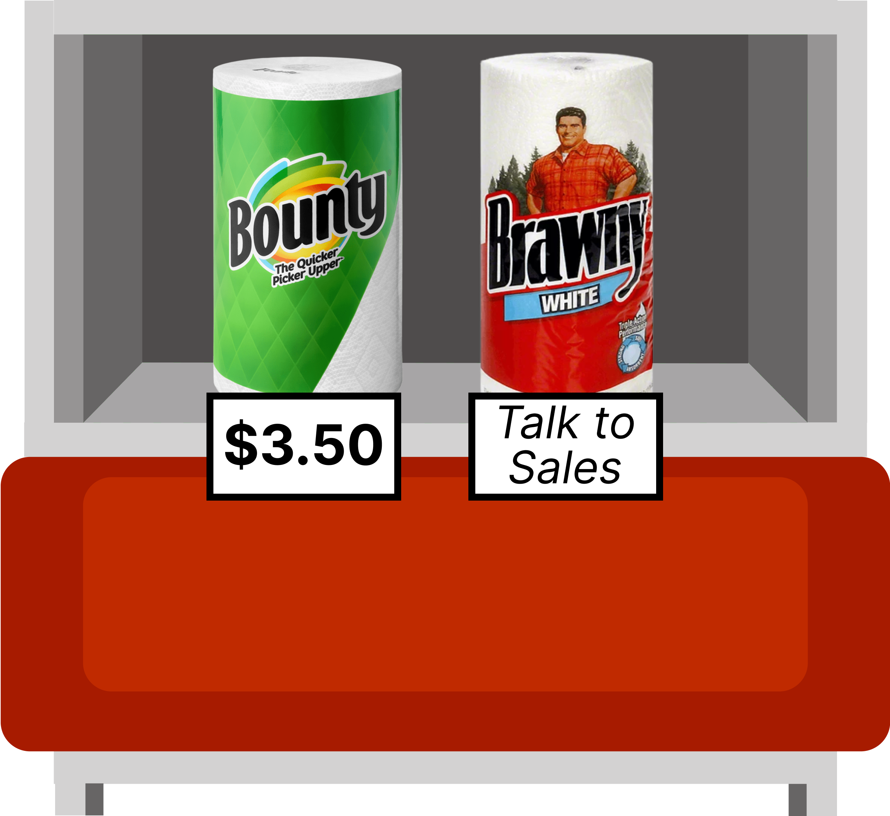

In a prior role, I experienced friction with my sales team's leadership:

- They emphasized the needs of the economic buyer and neglected the end-users.
- They withheld key performance indicators from prospects (i.e. pricing, number of customers, customer satisfaction).
- They demeaned our competitors by giving them no credit for product innovations or correctly executing on the points above.

Other leaders tried to defend the main sales leader. "Oh, they're just old school," or "They just take a more traditional approach to business." I didn't, and still don't, find this a satisfactory excuse. So, it got me thinking... what *does* "old school business" mean? I didn't want this essay to be an anecdotal critique, so I shelved it. But after reading a research paper, it all clicked...

### The Market for Lemons

[*The Market for Lemons*](https://www.sfu.ca/~wainwrig/Econ400/akerlof.pdf) was written in 1970 by Nobel laureate economist [George Akerlof](https://en.wikipedia.org/wiki/George_Akerlof). The paper explains how an information imbalance between buyers and sellers can lead to a decrease in market size. Here, I'll explain Akerlof's point through a layman example:

In the 90s, first-time homebuyers could only view houses through agents who had privileged access to listings. All information about a house’s estimated price, features, and known issues came from the agent. *This created a power dynamic where agents knew much more than buyers*. Some agents exploited this by selling low-quality homes ("lemons") at inflated prices.  In Pittsburgh, we refer to these types of agents as "[jagoffs](https://www.yajagoff.com/whats-a-jagoff/)". With enough jagoffs selling lemons, frustrated buyers left the market, which led to prices dropping, which led to honest agents not getting fair prices. This could spiral into ultimate market failure.

It's remarkable how a 50 year-old paper about powerful, dishonest sellers still resonates! Akerlof introduced how markets counteracted buyer uncertainty with tactics like guarantees, brand names, and certifications. However, the 20th-century economist had no chance of foreseeing the most revolutionary, scalable way to inform buyers... the world wide web.

In 2004, Rich Barton was shopping for a house and couldn't find a house's pictures, price, or even the address without an agent. Inspired by *The Market for Lemons*, he and his team started organizing public data, developed estimation algorithms, and threw it on a free website. [They called it Zillow.](https://www.npr.org/2021/06/11/1005526927/expedia-zillow-rich-barton) Overnight, *Zillow dramatically diminished the information gap between buyers and sellers*. Now, consumers can appraise an entire county's housing market before lunch. Although agents are still required in a housing transaction, Zillow keeps the institution in check. 

The infinite scale of the Internet has disrupted the world by increasing transparency to traditionally opaque industries. Similar transformations occurred with Expedia (travel), Carfax (used cars), Glassdoor (employment), and Yelp (restaurants).¹

### Old vs. New

"Old School Business" is relationship selling in a less-connected world where sellers had more control over the buyer's information- an era where a review, a price check, and a competitor wasn't [a click away](https://www.forbes.com/sites/davidwismer/2012/10/14/googles-larry-page-competition-is-one-click-away-and-other-quotes-of-the-week/). It fails to recognize that technology has completely changed the buyer-seller dynamic with market transparency. In an era where negotiation was a core profit driver, there were no advantages in sharing information with customers.²

"New School Business" is a reaction to the technological progression of abundant information and competition. If your website doesn't show price, a competitor's will. If you misrepresent your product, Redditors will surely correct you. If you sell a lemon, the market of ideas will figure out you're a fraud pretty quickly. In New School Business, transparency, product-market fit, and customer success win in the end.

### Hope for Capitalism?

If you've read my prior essays on [Radical Transparency](https://ben-mini.github.io/2024/the-browser-company-and-radical-transparency), [Omotenashi](https://ben-mini.github.io/2024/omotenashi), and [The Meaning of Life](https://ben-mini.github.io/2023/the-meaning-of-life), you're aware that I have an obsession with correlating trust and honesty to business success. I don't believe this to sleep better at night. I believe this because technological change is pushing commerce in a direction where there is less bullshit between a buyer and a seller. An ideal capital transaction is when both actors say "thank you" to each other *of equal balance*. If one feels the other got the upper hand, the invisible hand of capitalism will hunt to solve this imbalance. It's papers like *The Market for Lemons* that give me hope for capitalism. It suggests that as we give regular people more information, more trust, and more honesty, the "thank you equation" will balance out.

I've accomplished my goal of making both old and young people mad at this post 😜.

---

### Footnotes

¹ If you're looking for a good business idea, consider this: what markets have an imbalance in information between the buyer and the seller? What can a businessperson do to democratize that information?

² There are plenty of things redeemable about Old School Business. I love in-person meetings, sending thank you notes by mail, and maintaining a two-sided connection with customers.

