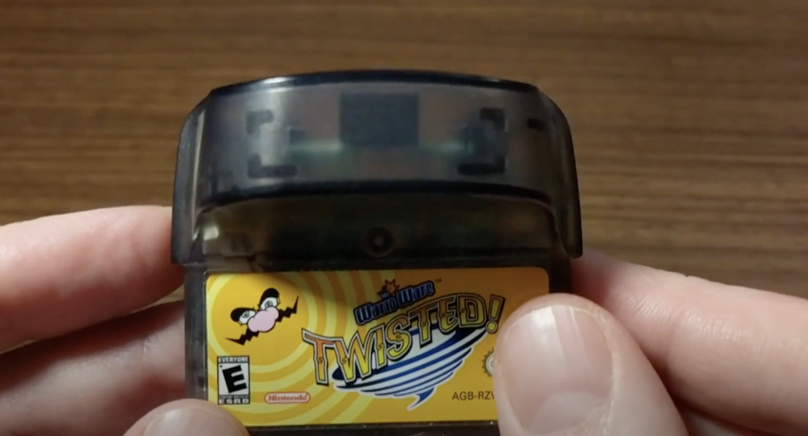

This is a fun one. Below is a brief list of the most mind-blowing tech moments in my 27 years of life. There's nothing too heady here- just an exercise in what might have made me get so into tech.

### 1. *WarioWare: Twisted* (2006)

At my community center, waiting for my friend's karate class to finish, I was handed a Gameboy Advance with *WarioWare: Twisted* (WWT). The clunky cartridge of WWT intrigued me:



Then, I turned it on:



**The cartridge had a freaking gyroscope in it that detected motion!!** While I don't remember many specifics about the game's plot or objectives, I recall ***staring*** at the cartridge's internals. How did they fit a steering wheel into that? Who at Nintendo pitched an idea like this? These were my first critical thoughts about the relationship between hardware, software, and risky business.

### 2. iPod Touch & App Store (2007)

Three months after the [iPhone's iconic announcement](https://www.youtube.com/watch?v=MnrJzXM7a6o), [Apple unveiled the iPod Touch](https://www.youtube.com/watch?v=OvHz2aIZozA). To a 5th grader, the iPod Touch was essentially a handheld gaming console. What struck me the most was the ease of downloading all these games from the App Store. With Wi-Fi, you were seconds away from playing any game within your 8 gigabytes of storage. I spent hours scrolling through the App Store, exploring developers' profiles, and reading their best release notes.

The App Store changed what it meant to develop and sell software. Purchasing apps through your phone rather than a trip to Gamestop dramatically reduced frictions between creators and consumers. Apps' lack of physical costs and ability to receive continuous updates enabled new business models like paywalls, usage-based pricing, and one-person companies.

### 3. Google Docs (2011)

In 9th grade English class, Ms. Falce assigned us an in-class essay in the computer lab. She directed us to docs.google.com and had us work in the all-new Google Docs.

Three features of Google Docs blew my mind:

1. **Auto-Save:** Before Google Docs, the stress of wondering if you saved your document was like leaving the burner on. But with auto-save, Google turned the archaic "email it yourself" strategy into an ambient feature.
2. **Links, Not Files:** Before Google Docs, files lived either in your C-Drive, thumb drive, or email. But after seeing my Google Doc's messy URL, I immediately understood the value of cloud computing. All the processing and storage happened on Google's servers, not mine!
3. **Multiplayer:** Multiple users could collaborate on a doc at once, allowing two kids to work in the same document in real-time. While multiplayer existed in video games and IM, Google Docs was the first to bring it to school. It felt fast, gratifying, and seamless.

Google Docs was the first time technology blew me away in a work and education context. It made me think about the competitive landscape of big tech and how Microsoft would respond. Google Docs was *so good* that my small-town public school switched from the incumbent. Google seemed to recognize Docs' success by promoting its lead, Sundar Pichai, to CEO in 2015.

### 4. My First API Call (2016)

I started learning Python in 2016 to prepare for an internship. My first days were spent understanding variables, lists, loops, and functions. It was effective, but where was the "magic" of programming that romanticized me to learn in the first place? Something was missing...

The next day, I was introduced to *web APIs*. A web API allows you to create, read, update, and delete data from another developer's application. My first API call search an address with the Google Maps API. It looked something like this:

```python
import requests

api_key = 'PLACE_GOOGLE_MAPS_API_KEY_HERE'
address = '1320 E 10th St, Bloomington, IN 47405'
url = 'https://maps.googleapis.com/maps/api/geocode/json?address=' + address + '&key=' + api_key

response = requests.get(url)
print(response.json())
```

In seconds, Google returned the exact longitude/latitude, county, and name of the address! A couple things clicked:

1. In a few lines of code, I leveraged *millions* of lines of Google Maps code. It motivated me to search [all the world's APIs](https://rapidapi.com/search/Search?sortBy=ByRelevance), realizing I could get data about news, sports, social media, music, and [even my own grades](https://canvas.instructure.com/doc/api/).
2. Reviewing API documentation is a better way to understand a product's purpose than its marketing site. APIs are as close as a non-employee can get to understanding a product's database, describing the nouns, verbs, and relationships the product offers.

APIs' accessibility and extensibility gave me the confidence to pursue programming. Whenever I start a new project, I know someone has likely solved a similar problem, and I can find their ideas via their API or open-source codebase. In the Internet era, programming is less about primitive engineering and more about finding, manipulating, and combining what others have already created.

### 5. GPT-2 (2019)

Heading into the end of college, I read an article about [OpenAI's announcement of GPT-2](https://openai.com/index/better-language-models/). GPT-2's announcement was controversial, with [articles citing its dangerous ability](https://www.theverge.com/2019/11/7/20953040/openai-text-generation-ai-gpt-2-full-model-release-1-5b-parameters) to generate fake articles, stories, and code. Curious, I downloaded OpenAI's [open-sourced version of the model](https://github.com/openai/gpt-2) and got to work.

With the 2020 election coming up, I decided to use GPT to write the perfect campaign announcement speech. I detailed this project and its results in [this Medium post](https://medium.com/linebyline/presidential-speech-algorithm-ec755995887a).

Using GPT-2 in my college dorm room feels like one of those "moments" I'll tell my future kids about. It was the first time in my computing life where *an unexpected output was expected*. Programming is a brutally mathematical endeavor by design: one character off and your entire code breaks. GPT-2 was the first time I felt art inside my black, monospaced terminal. The funny phrasing and mistakes was a feature, not a bug! I knew the world would want to see more of this.

### Conclusion

Let's review:

- WarioWare exemplified the perfect pairing of hardware and software.
- The iPod Touch foreshadowed the ease of software distribution.
- Google Docs normalized real-time, multiplayer UX.
- APIs empowered me to stand on top of giants and leverage their work.
- GPT-2 is the next evolution of marriage between technology and the liberal arts.

There are two types of products: pleasure products and time-saving products. With the exception of *WarioWare*, I think all the innovations above were both! As I continue to build my own products, I can only hope that my users will find them as mind-blowingly fun and efficient as I found these.
