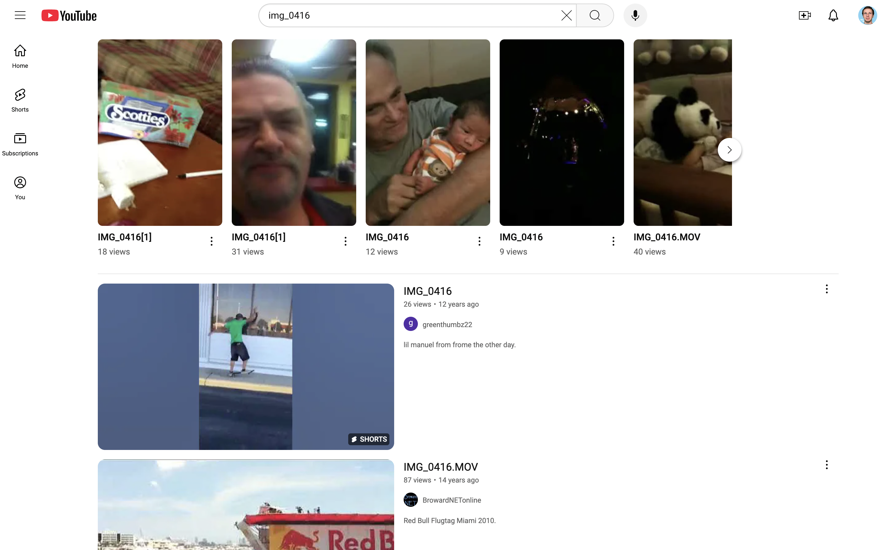

Between 2009 and 2012, Apple iPhones and iPod Touches included a feature called "Send to YouTube" that allowed users to upload videos directly to YouTube from the Photos app. 

The feature worked... really well. In fact, [YouTube reported a 1700% increase in total video uploads](https://www.macrumors.com/2009/06/25/youtube-daily-mobile-uploads-have-increased-400-since-launch-of-iphone-3gs/) during the first half of 2009- crediting that growth to its strong integrative ties to Apple and social networks. However, this two-click upload feature was short-lived when Apple severed ties Apple severed ties with YouTube by [removing its homegrown app in 2012](https://archive.nytimes.com/bits.blogs.nytimes.com/2012/08/06/apple-to-remove-youtube-app-from-iphone-and-ipad/).

While Send to YouTube can be thoroughly analyzed as a milestone on the "frenemy" timeline between Apple and Google, I want to explore a pleasant consequence of this moment. Apple uses the ‘IMG_XXXX’ naming convention for all images and videos captured on iOS devices, where XXXX is a unique sequence number. The first image you take is named "IMG_0001", the second is "IMG_0002" and so on. During the Send to YouTube era of 2009 and 2012, the title of one's YouTube video was defaulted to this naming convention. Unwitting content creators would then upload their videos on a public site with a barely-searchable name. To this day, ***there are millions of these videos.***

Try searching for "IMG_XXXX" on YouTube, replacing "XXXX" with your favorite numbers (I used my birthday, 0416). See what you get!

There's something surreal about these videos that engages you in a way you've never felt. None were edited, produced or paraded for mass viewing. In fact, many were likely uploaded by accident or with a misunderstanding that complete strangers could see it. YouTube automatically removes harmful or violent content, so what remains exists in a unique, almost paradoxical state: *forbidden, yet harmless.* Putting all this together, searching IMG_XXXX presents the viewer with the most authentic social feed ever seen on the Internet- in video, no less!

While many videos are redundant snippets of a concerts, basketball games, or kids' recitals, you also get one-of-a-kind videos that provides a glimpse into a complete stranger's life. You'll see a tumultuous event that made them, their partner, or their friend say, "hey, let's record this". I'd like to show you three of these videos that I found in my search.

### [IMG_0416 (Mar 17, 2015) - 23 views ](https://www.youtube.com/watch?v=MR3mv5SbAi4)



The video shows a woman excitedly unboxing a book she received in the mail. From context clues, she seems to be a wife and mother from Memphis who's unboxing the first published copy of her book. She thanks the friends, family, and publishers who made this happen.

After a quick Google Search, I was able to find the book: <u>*A Profit / Prophet to Her Husband: Are you ready to be a wife?*</u> The book is meant "to help wives understand who they are and who they were designed to be." It clocks in at 94 pages and has 30 ratings on Amazon!  Go IMG_0416! I don't care what you're creating- [I'm just a fan of creators](https://ben-mini.github.io/2023/the-meaning-of-life). It looks like she kept at it- [making a second book in 2020](https://www.amazon.com/Secret-Loving-Yourself-Unconditionally-Self-Worth-ebook/dp/B086PVGPHZ?ref_=ast_author_dp)! 

### [IMG_0416.MOV (June 24, 2015) - 26 views](https://www.youtube.com/watch?v=JDuGXBteSno)



The video appears to show a woman playing a matching card game that teaches you "the basic of the potash stuff" according to the cameraman. As the woman (who I assume is the cameraman's supportive mother) flips two matching cards, she reads off the countries who produce the most [potash](https://en.wikipedia.org/wiki/Potash). 

I honestly didn't know anything about potash! Turns out that it is a mineral with large amount of potassium, which is helpful as a plant fertilizer. With Canada producing the largest reserves in the world, [the vast majority of Canadian potash is found in Saskatchewan](https://arc.net/l/quote/fdbongnj). I wonder if the family in the video  lives in Canada. Or, this is just another school project that teaches you random facts... I miss those!

### [IMG_0416 (Feb 8, 2011) - 114 views](https://www.youtube.com/shorts/HXBKniNtsHk)



Let's end of a fun one. The video shows a young man snorting powdered sugar and dealing with the consequences of it. Given his BU hoodie, Dunkin' Donuts location, and ironic depiction of drug use, I gotta say this is a **VERY** Boston video.

What’s genuinely heartwarming is the shared laughter between the man, the camerawoman, and a motherly figure leaving Dunkin’. The camerawoman calls her “Myra” at the end, suggesting they all know each other. This mix of community at franchised restaurant, and the remark about having “nothing better to do” perfectly captures the heartbeat of American suburbia.
